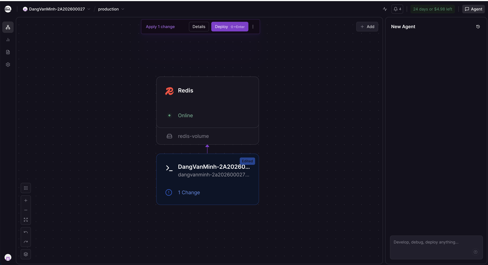
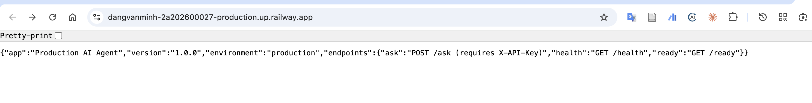

# Day 12 Lab — Production AI Agent

> **AICB-P1 · VinUniversity 2026**

| Thông tin | |
| --- | --- |
| **Họ và tên** | Đặng Văn Minh |
| **MSSV** | 2A202600027 |
| **Email** | minhdv0201@gmail.com |
| **Ngày nộp** | 17/04/2026 |
| **Public URL** | [dangvanminh-2a202600027-production.up.railway.app](https://dangvanminh-2a202600027-production.up.railway.app) |
| **Platform** | Railway |

---

## Mô Tả Dự Án

Production-ready AI Agent kết hợp **tất cả** concepts từ Day 12:

- **Containerization** — Multi-stage Dockerfile, image < 400 MB
- **Cloud Deployment** — Deploy trên Railway với public URL
- **API Security** — API Key authentication + Rate limiting + Cost guard
- **Reliability** — Health/readiness probes, graceful shutdown
- **Scalability** — Stateless design (Redis), Nginx load balancer

Agent trả lời câu hỏi qua REST API, hỗ trợ conversation history, và có thể scale lên nhiều instances nhờ state được lưu trong Redis.

---

## Cấu Trúc Project

```text
06-lab-complete/
├── app/
│   ├── main.py          # FastAPI app — kết hợp tất cả middleware
│   ├── config.py        # 12-factor config (pydantic_settings)
│   ├── auth.py          # API Key authentication
│   ├── rate_limiter.py  # Sliding window rate limiter (Redis)
│   └── cost_guard.py    # Monthly budget guard (Redis)
├── utils/
│   ├── mock_llm.py      # Mock LLM (không cần API key)
│   └── real_llm.py      # OpenAI integration (optional)
├── Screenshots/
│   ├── dashboard_railway.png
│   └── test_url.png
├── Dockerfile           # Multi-stage build
├── docker-compose.yml   # agent + redis + nginx
├── nginx.conf           # Load balancer config
├── railway.toml         # Railway deployment config
├── render.yaml          # Render deployment config
├── requirements.txt
├── .env.example         # Template (không commit .env thật)
├── .dockerignore
├── MISSION_ANSWERS.md   # Câu trả lời tất cả exercises
├── DEPLOYMENT.md        # Thông tin deployment + test commands
└── check_production_ready.py
```

---

## Hướng Dẫn Chấm Điểm

### Kiểm tra public URL (nhanh nhất)

```bash
# 1. Health check
curl https://dangvanminh-2a202600027-production.up.railway.app/health

# 2. Không có API key → phải trả về 401
curl -X POST https://dangvanminh-2a202600027-production.up.railway.app/ask \
  -H "Content-Type: application/json" \
  -d '{"question": "Hello", "user_id": "test"}'

# 3. Có API key → trả về 200
curl -X POST https://dangvanminh-2a202600027-production.up.railway.app/ask \
  -H "X-API-Key: my-secret-key-123" \
  -H "Content-Type: application/json" \
  -d '{"question": "What is Docker?", "user_id": "grader"}'

# 4. Rate limit — gọi 12 lần, lần 11+ phải trả về 429
for i in {1..12}; do
  echo -n "Request $i: "
  curl -s -o /dev/null -w "%{http_code}" \
    -X POST https://dangvanminh-2a202600027-production.up.railway.app/ask \
    -H "X-API-Key: my-secret-key-123" \
    -H "Content-Type: application/json" \
    -d "{\"question\": \"test $i\", \"user_id\": \"ratetest\"}"
  echo ""
done
```

### Chạy local với Docker Compose

```bash
# 1. Clone và setup
git clone <repo-url>
cd 06-lab-complete
cp .env.example .env.local

# 2. Chạy full stack (agent + redis + nginx)
docker compose up

# 3. Test qua nginx (port 80)
curl http://localhost/health
curl http://localhost/ready

curl -X POST http://localhost/ask \
  -H "X-API-Key: my-secret-key-123" \
  -H "Content-Type: application/json" \
  -d '{"question": "Explain microservices", "user_id": "user1"}'

# 4. Scale lên 3 instances
docker compose up --scale agent=3

# 5. Chạy script kiểm tra tự động
python check_production_ready.py
```

### Chat UI (demo trực quan)

Truy cập trực tiếp trên trình duyệt:
[https://dangvanminh-2a202600027-production.up.railway.app/chat](https://dangvanminh-2a202600027-production.up.railway.app/chat)

---

## Tính Năng Đã Implement

| Tính năng | Implementation | File |
| --- | --- | --- |
| API Key Auth | `APIKeyHeader`, so sánh với env var | `app/auth.py` |
| Rate Limiting | Sliding window, Redis sorted set, 10 req/min | `app/rate_limiter.py` |
| Cost Guard | Monthly budget $10/user, Redis counter, reset đầu tháng | `app/cost_guard.py` |
| Health probe | `GET /health` → 200 + uptime/version info | `app/main.py` |
| Readiness probe | `GET /ready` → 200 khi sẵn sàng, 503 khi startup/shutdown | `app/main.py` |
| Graceful shutdown | `SIGTERM` handler + `lifespan` context | `app/main.py` |
| Stateless design | Conversation history lưu Redis, TTL 24h | `app/main.py` |
| Structured logging | JSON format, không log secrets | `app/main.py` |
| Multi-stage Docker | Builder stage + runtime stage, non-root user | `Dockerfile` |
| Load balancing | Nginx round-robin → nhiều agent instances | `nginx.conf` |
| Config management | `pydantic_settings`, tất cả đọc từ env vars | `app/config.py` |

---

## Environment Variables

| Variable | Mô tả | Default |
| --- | --- | --- |
| `AGENT_API_KEY` | API key để authenticate | `my-secret-key-123` |
| `REDIS_URL` | Redis connection string | `redis://localhost:6379/0` |
| `RATE_LIMIT_PER_MINUTE` | Số request tối đa/phút | `10` |
| `DAILY_BUDGET_USD` | Budget tối đa/ngày | `5.0` |
| `ENVIRONMENT` | `development` / `production` | `development` |
| `OPENAI_API_KEY` | OpenAI key (optional, dùng mock nếu không có) | — |

---

## Screenshots

| | |
| --- | --- |
| Railway Dashboard |  |
| Test kết quả |  |
